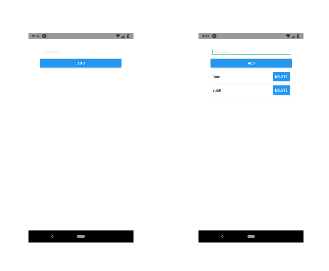

# React Native Shopping List app (groceristar app)

#### Table of contents
[Trello Board](https://trello.com/b/n2ufANiO/groceristar-app)

[:(Article]()

[Documentation website](https://groceristar.github.io/documentation/)

[Sitemap](https://groceristar.github.io/documentation/docs/gs-sitemap.html)

[Screens from web version](https://groceristar.github.io/documentation/docs/gs-shoplist-screens.html)

#### Overview

Basic functionality:

- Page with grocery list collection
- Grocery list details page
- Departments list
- Shopping list
- Login screen

## User Stories

User can:
* Create an account
* Successfully login
* Add items to the shopping list
* Edit items previously created
* Delete items from grocery list
* Mark items as purchased
* Mark items as favorites
* View all favorite items in one page
* Click on item to get more information about item
* User can logout

## Screenshots

## Shopping list app videos

- [Login, View Departments](#login-view-departments)
- [Login + View Departments List](#login--view-departments-list)
- [Introduction Screens](#introduction-screens-1)
- [Departments with Ingredients](#departments-with-ingredients)
- [Departments List with Ingredients with checkboxes](#departments-with-ingredients)

#### Login, View Departments

---
#### Login + View Departments List

---
#### Introduction Screens

---
#### Departments with Ingredients

---
#### Departments List with Ingredients with checkboxes

---
## Important Notes
- We'll use [Sentry Releases](https://docs.sentry.io/learn/releases/) to ship better code
- We'll use [git-flow](https://www.atlassian.com/git/tutorials/comparing-workflows/gitflow-workflow) so we'll not intersect between developers
- We'll use PR for pushing your code into master and I'll be a reviewer
- We'll use [bin-flow](https://github.com/facebook/flow)
- For making react components ready for cross-projects we'll use [Bit](https://bitsrc.io/).
- We'll use [Jest + Enzyme for tests](https://facebook.github.io/jest/)
- We'll use [Netlify](https://www.netlify.com/) in order to have ability review our pages online
- We'll use [Travis CI](http://travis-ci.org) for setting up tests coverage
- Send API calls to server. @TODO share with team an API endpoints. for making calls use Axious.
- For subscription service we'll use [Paddle.js](https://paddle.com/docs/paddle-js-overlay-checkout/)

- Each component should looks simple and understandable
- We should use [ReactStrap](https://reactstrap.github.io/) components for faster development process
- You should create and maintain documentation [GitBook](https://www.gitbook.com/)

#### Departments, Ingredients with ids

#### Create New Grocery List and collection of grocery lists

## Expo

you can use the app by scanning the qr code using the Expo app

check out the project at Expo [react-native-shoppin-list](https://expo.io/@vineeshvk/react-native-shopping-list)
